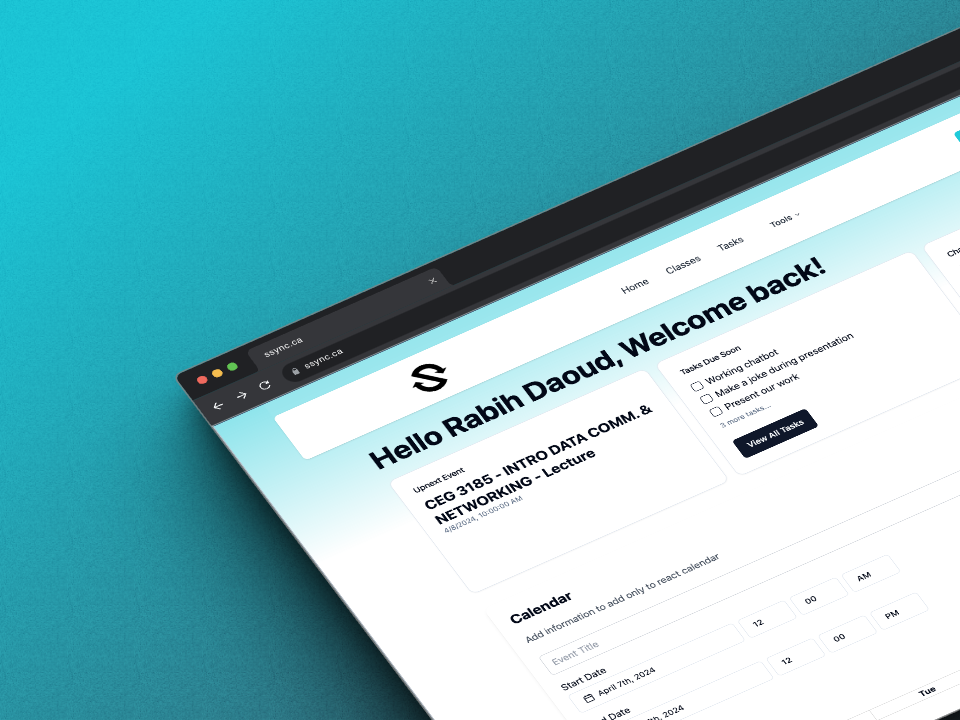

# SyllabusSync


<p align="center">
  
</p>

SyllabusSync is your AI-powered academic companion, designed to transform the way you manage your academic life. Leveraging the cutting-edge capabilities of artificial intelligence, SyllabusSync personalizes your study schedules by integrating seamlessly with Google Calendar. It analyzes syllabi and assignment deadlines to predict optimal study sessions, ensuring you stay ahead in your academic journey. It's not just a smart planner; it's an adaptive tool that boosts your productivity and helps you meet every deadline with ease. With SyllabusSync, stay in sync with your studies, not behind.

## Features

- **AI-Powered Scheduling:** SyllabusSync uses advanced AI to analyze your syllabi and assignments, optimizing your study schedule around your life.
- **Google Calendar Integration:** Effortlessly syncs with your Google Calendar, keeping your academic and personal life organized in one place.
- **Responsive Design:** Built using Next.js and Tailwind CSS, SyllabusSync offers a sleek, user-friendly interface that adapts to any device.

## Technologies

- **Next.js & TypeScript:** A powerful React framework paired with TypeScript for robust, scalable applications.
- **Tailwind CSS:** A utility-first CSS framework for rapidly building custom designs.
- **Vercel:** Hosting solution providing effortless deployment and superior performance.
- **OpenAI Assistant:** Leveraging AI to provide intuitive interactions and functionalities.

## Getting Started

To embark on your journey with SyllabusSync, follow these steps:

1. Clone the project repository:

   ```bash
   git clone https://github.com/rabi3daoudd/SyllabusSync.git

   ```

2. Navigate to the project directory:
   ```bash
   cd SyllabusSync
   npm install
   npm run dev
   ```

3. Some environment variables are necessary to run the project smoothly. Please reach out to rmura096@uottawa.ca to get the required .env configurations.

4. Visit `http://localhost:3000` in your browser to start using SyllabusSync.

## Documentation and Resources

For more detailed information about SyllabusSync, including project overviews, client details, and setup requirements, please visit our [Wiki](https://github.com/rabi3daoudd/SyllabusSync/wiki):

- [Project Overview](https://github.com/rabi3daoudd/SyllabusSync/wiki/Project-Overview)
- [Client Details](https://github.com/rabi3daoudd/SyllabusSync/wiki/Client)
- [Documentation](https://github.com/rabi3daoudd/SyllabusSync/wiki/Documentations)
- [Requirements](https://github.com/rabi3daoudd/SyllabusSync/wiki/Requirements)
